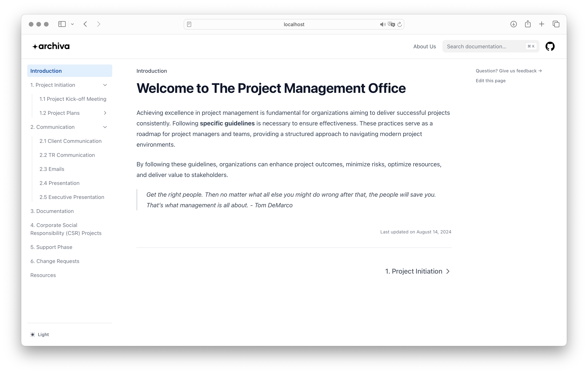

# Welcome to Archiva

The Archiva documentation website for the Project Management Office (PMO) is built using the Nextra framework to provide clear, structured, and interactive documentation for PMO processes and guidelines. The site offers a sleek interface where users can easily navigate through essential project management documentation.

[]

## About Nextra

Nextra is a modern framework for building static documentation websites. It uses React and Markdown to create clean, interactive, and high-performance documentation with customizable layouts and built-in features like search and navigation.

## How to modify pages

